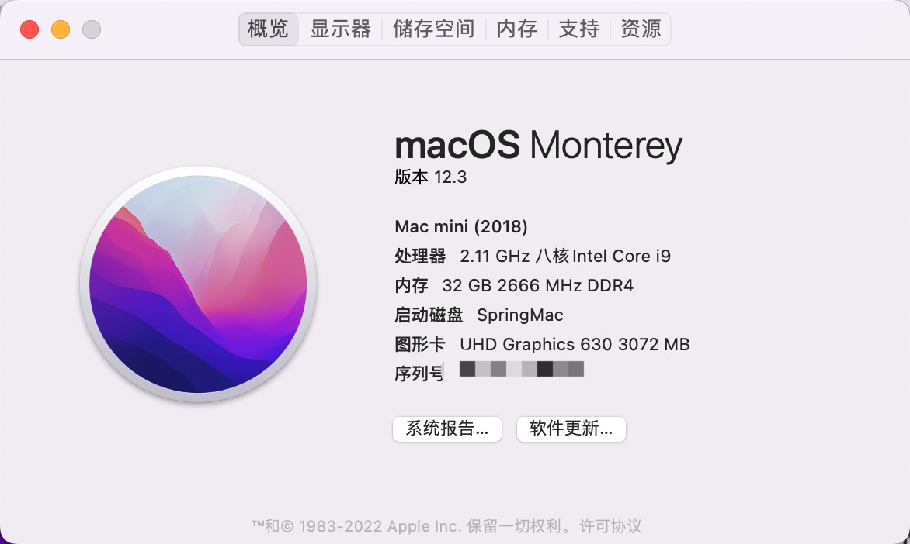

# Dell-Optiplex-5070mff-Hackintosh

[](https://github.com/WingLim/Dell-Optiplex-5070mff-Hackintosh/actions/workflows/analyze.yml)


English | [中文](https://github.com/WingLim/Dell-Optiplex-5070mff-Hackintosh/blob/main/README_CN.md)

**EFI tested on Big Sur 11.6**

Use OpenCore `v0.7.3`



## Hardware

- Desktop Computer: [Dell OptiPlex 5070 Micro Form Factor](https://www.dell.com/en-us/work/shop/desktops-all-in-one-pcs/optiplex-5070-micro/spd/optiplex-5070-micro)
- CPU: [Intel® Core™ i5-9500T Processor](https://ark.intel.com/content/www/us/en/ark/products/191052/intel-core-i5-9500t-processor-9m-cache-up-to-3-70-ghz.html)
- iGPU: Intel® UHD Graphics 630
- RAM: 16GB DDR4 2666 Daul Channel
- Storage: KIOXIA RC10 NVME SSD 500G
- Wi-Fi & Bluetooth: DW1820A
- Audio: Realtek ALC255

**NOTICE:** When use DW1820A, you need to block 4 pins, see here: https://blog.daliansky.net/DW1820A_BCM94350ZAE-driver-inserts-the-correct-posture.html

## Working

- CPU Turbo Boost
- iGPU acceleration
- Airdrop & Airplay & Handoff
- All USB Ports
- LAN & Wireless Network
- Internal Speaker & 3.5mm HeadSet/HeadPhone & Line Out
- Sleep

## BIOS Settings via GRUB

Put `GRUB` folder `EFI` in the root of flash disk, boot computer from it.

See more on the bottom of README.md

- Set Pre-Allocated DVMT to 64M: ***setup_var 0x8DC 0x02***
- Disable CFG lock: ***setup_var 0x5BE 0x00***

## BIOS Settings

- System Configuration → SATA Operation: ***AHCI***
- Secure Boot → Secure Boot Enable: ***Disabled***
- Intel® Software Guard Extensions™ → Intel® SGX™ Enable: ***Disabled***
- Power Management → Block Sleep: ***check***
- Virtualization Support → VT for Direct I/O: ***uncheck***

## config.plist Settings

Notice: OpenCore Configurator need the correct version for OpenCore.

OpenCore Configurator v2.3.10 for OpenCore v0.6.7

Use [OpenCore Configurator](https://mackie100projects.altervista.org/occ-changelog-version-2-30-1-0/) or [GenSMBIOS](https://github.com/corpnewt/GenSMBIOS) to generate `System Serial Number` and `System UUID` etc.

## Do Fix

### HeadSet Micphone

More details to see: [MicFix](https://github.com/WingLim/MicFix)

```bash
brew tap winglim/taps
brew install micfix
```

## Settings dump from BIOS

```
0x4DAC0 	Form: View/Configure CPU Lock Options, FormId: 0x273D {01 86 3D 27 BD 01}
0x4DAC6 		One Of: CFG Lock, VarStoreInfo (VarOffset/VarName): 0x5BE, VarStore: 0x1, QuestionId: 0x333, Size: 1, Min: 0x0, Max 0x1, Step: 0x0 {05 91 B6 03 B7 03 33 03 01 00 BE 05 10 10 00 01 00}
0x4DAD7 			One Of Option: Disabled, Value (8 bit): 0x0 {09 07 04 00 00 00 00}
0x4DADE 			One Of Option: Enabled, Value (8 bit): 0x1 (default) {09 07 03 00 30 00 01}
0x4DAE5 		End One Of {29 02}
0x4DAE7 		One Of: Overclocking Lock, VarStoreInfo (VarOffset/VarName): 0x65A, VarStore: 0x1, QuestionId: 0x334, Size: 1, Min: 0x0, Max 0x1, Step: 0x0 {05 91 B2 03 B3 03 34 03 01 00 5A 06 10 10 00 01 00}
0x4DAF8 			One Of Option: Disabled, Value (8 bit): 0x0 {09 07 04 00 00 00 00}
0x4DAFF 			One Of Option: Enabled, Value (8 bit): 0x1 (default) {09 07 03 00 30 00 01}
0x4DB06 		End One Of {29 02}
0x4DB08 	End Form {29 02}


0x5529B 		One Of: DVMT Pre-Allocated, VarStoreInfo (VarOffset/VarName): 0x8DC, VarStore: 0x1, QuestionId: 0x2741, Size: 1, Min: 0x0, Max 0xFE, Step: 0x0 {05 91 CE 05 E1 05 41 27 01 00 DC 08 10 10 00 FE 00}
0x552AC 			Default: DefaultId: 0x0, Value (8 bit): 0x1 {5B 06 00 00 00 01}
0x552B2 			One Of Option: 0M, Value (8 bit): 0x0 {09 07 CF 05 00 00 00}
0x552B9 			One Of Option: 32M, Value (8 bit): 0x1 {09 07 D0 05 00 00 01}
0x552C0 			One Of Option: 64M, Value (8 bit): 0x2 {09 07 D1 05 00 00 02}
0x552C7 			One Of Option: 4M, Value (8 bit): 0xF0 {09 07 D2 05 00 00 F0}
0x552CE 			One Of Option: 8M, Value (8 bit): 0xF1 {09 07 D3 05 00 00 F1}
0x552D5 			One Of Option: 12M, Value (8 bit): 0xF2 {09 07 D4 05 00 00 F2}
0x552DC 			One Of Option: 16M, Value (8 bit): 0xF3 {09 07 D5 05 00 00 F3}
0x552E3 			One Of Option: 20M, Value (8 bit): 0xF4 {09 07 D6 05 00 00 F4}
0x552EA 			One Of Option: 24M, Value (8 bit): 0xF5 {09 07 D7 05 00 00 F5}
0x552F1 			One Of Option: 28M, Value (8 bit): 0xF6 {09 07 D8 05 00 00 F6}
0x552F8 			One Of Option: 32M/F7, Value (8 bit): 0xF7 {09 07 D9 05 00 00 F7}
0x552FF 			One Of Option: 36M, Value (8 bit): 0xF8 {09 07 DA 05 00 00 F8}
0x55306 			One Of Option: 40M, Value (8 bit): 0xF9 {09 07 DB 05 00 00 F9}
0x5530D 			One Of Option: 44M, Value (8 bit): 0xFA {09 07 DC 05 00 00 FA}
0x55314 			One Of Option: 48M, Value (8 bit): 0xFB {09 07 DD 05 00 00 FB}
0x5531B 			One Of Option: 52M, Value (8 bit): 0xFC {09 07 DE 05 00 00 FC}
0x55322 			One Of Option: 56M, Value (8 bit): 0xFD {09 07 DF 05 00 00 FD}
0x55329 			One Of Option: 60M, Value (8 bit): 0xFE {09 07 E0 05 00 00 FE}
0x55330 		End One Of {29 02}
```
